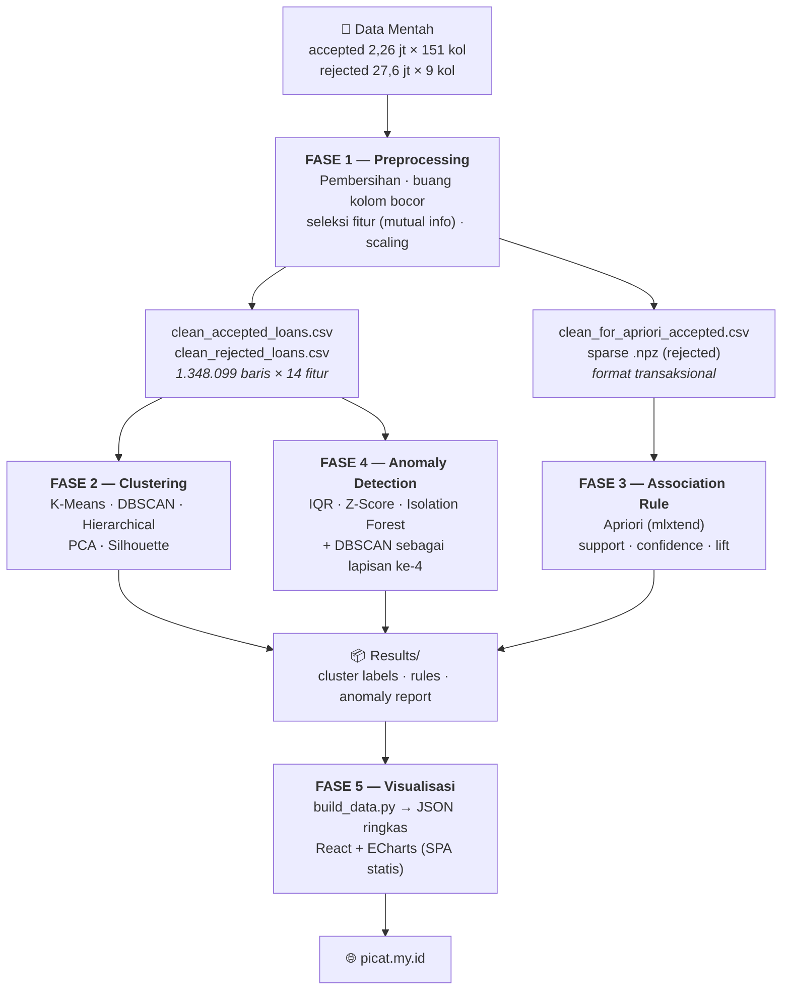

# Knowledge Discovery pada Data Pinjaman Lending Club (2007–2018)

> Proyek KDD lima fase yang menambang **2,26 juta pinjaman disetujui** dan **27,6 juta pengajuan
> ditolak** milik Lending Club, lalu menyajikan temuannya lewat dashboard web interaktif.

**Mata kuliah:** Data Mining

**Domain:** Perbankan / Peer-to-Peer Lending

**Metodologi:** KDD lima fase — Preprocessing → Clustering → Association Rule → Anomaly Detection → Visualisasi

| | |
|---|---|
| 🌐 **Dashboard live** | **[picat.my.id](https://picat.my.id)** |
| 📄 **Laporan lengkap** | [`LAPORAN_KNOWLEDGE_DISCOVERY.md`](LAPORAN_KNOWLEDGE_DISCOVERY.md) |
| 📊 **Dataset** | [Lending Club (Kaggle)](https://www.kaggle.com/datasets/wordsforthewise/lending-club) |
| 💻 **Repositori** | [github.com/StievenLee/Data-Mining-All-Lending-Club-loan](https://github.com/StievenLee/Data-Mining-All-Lending-Club-loan) |

---

## Daftar Isi

1. [Tentang Proyek](#1-tentang-proyek)
2. [Temuan Utama](#2-temuan-utama)
3. [Alur Kerja KDD](#3-alur-kerja-kdd)
4. [Struktur Repositori](#4-struktur-repositori)
5. [Dataset](#5-dataset)
6. [Instalasi](#6-instalasi)
7. [Cara Menjalankan](#7-cara-menjalankan)
8. [Rincian Tiap Fase](#8-rincian-tiap-fase)
9. [Dashboard (Fase 5)](#9-dashboard-fase-5)
10. [Keterbatasan yang Diketahui](#10-keterbatasan-yang-diketahui)
11. [Glosarium](#11-glosarium)
12. [Tim](#12-tim)

---

## 1. Tentang Proyek

Lending Club adalah platform pinjaman *peer-to-peer*. Setiap pengajuan dinilai, diberi peringkat
kredit (*grade* A–G), lalu ditentukan suku bunganya. Yang lolos menjadi pinjaman; yang tidak lolos
tercatat di dataset terpisah.

Data ini sudah sangat sering dianalisis, dan sebagian besar analisisnya berhenti pada kesimpulan
yang bisa ditebak: skor kredit rendah → bunga tinggi → risiko gagal bayar lebih besar. Karena itu
proyek ini menetapkan satu pertanyaan sentral yang lebih ketat:

> **Apa yang kami temukan yang tidak sudah terlihat dari data mentah?**

Sebuah temuan hanya dihitung menjawab pertanyaan itu bila memenuhi tiga syarat:

1. **Tidak bisa** diperoleh dengan satu tabel pivot sederhana.
2. **Tidak sekadar** mengulang aturan main yang memang sudah tertanam di dalam data.
3. **Mengubah** keputusan yang akan diambil.

Konsekuensinya keras: 89% "temuan" pada versi pertama analisis ini gugur karena hanya memantulkan
kembali kebijakan penetapan harga Lending Club sendiri. Proses pembuangan itu didokumentasikan
sebagai temuan tersendiri, bukan disembunyikan.

### Untuk siapa repositori ini

| Anda ingin… | Mulai dari |
|---|---|
| Membaca hasilnya saja | [Dashboard live](https://picat.my.id) atau [`LAPORAN_KNOWLEDGE_DISCOVERY.md`](LAPORAN_KNOWLEDGE_DISCOVERY.md) |
| Memahami metodenya | [§8 Rincian Tiap Fase](#8-rincian-tiap-fase) |
| Menjalankan ulang seluruh pipeline | [§6 Instalasi](#6-instalasi) → [§7 Cara Menjalankan](#7-cara-menjalankan) |
| Mengembangkan dashboard-nya | [`Phase 5 Dashboard Web/README.md`](Phase%205%20Dashboard%20Web/README.md) |

---

## 2. Temuan Utama

Lima temuan, diurutkan dari yang paling bisa ditindaklanjuti. Uraian lengkap beserta bukti angkanya
ada di [`LAPORAN_KNOWLEDGE_DISCOVERY.md`](LAPORAN_KNOWLEDGE_DISCOVERY.md).

| # | Temuan | Bukti kunci | Sumber |
|---|---|---|---|
| **1** | **Risiko gagal bayar terkuat melekat pada struktur kontrak, bukan pada peminjamnya.** Tenor 60 bulan berfungsi seperti corong: mengumpulkan bunga tinggi, grade rendah, dan nominal besar di satu tempat. | Tenor 60 bln → pinjaman besar yang gagal bayar: **lift 2,66×** | Fase 3 |
| **2** | **5.274 pinjaman terlihat wajar menurut semua ukuran umum, tetapi janggal begitu konteksnya diperhitungkan.** Bunga 15% biasa bagi FICO rendah, janggal bagi FICO sangat tinggi. | Gagal bayar **40,37%** — dua kali lipat populasi (19,98%) | Fase 4 |
| **3** | **Menyimpang di dua tingkat sekaligus jauh lebih berbahaya daripada di satu tingkat.** Irisan segmen berisiko × anomali individual. | 42.440 kasus, gagal bayar **36,55%** | Fase 2 × 4 |
| **4** | **Komposisi risiko platform bergeser diam-diam, dan angka tahun terakhir menipu.** Proporsi segmen High-Risk naik 2× lipat; penurunan gagal bayar 2018 adalah *right-censoring*, bukan perbaikan. | 11,1% (2009) → 24–29% (2013–2018) | Fase 2 |
| **5** | **Pola paling mengesankan secara angka justru yang paling tidak bernilai.** 88,8% aturan asosiasi awal hanyalah tautologi kebijakan harga yang menenggelamkan pola risiko sesungguhnya. | 4.102 pola → **25** yang benar-benar non-trivial | Fase 3 |

> ⚠️ **Batasan penting pada Temuan 1:** *confidence* pola gagal bayar ini rendah (13–17%), artinya
> mayoritas pinjaman bertenor 60 bulan **tetap lunas**. Pola ini **tidak boleh** dipakai untuk
> menolak satu pengajuan — nilainya ada di tingkat portofolio (pembatasan eksposur agregat).

---

## 3. Alur Kerja KDD



**Prinsip yang dijaga di sepanjang pipeline:**

- **Anti-leakage** — kolom yang baru tersedia *setelah* keputusan kredit diambil (skor kredit
  terkini, seluruh arus kas pasca-pinjaman) dibuang di Fase 1.
- **Validasi eksternal** — jumlah klaster Fase 2 dipilih berdasarkan kemampuannya memisahkan
  tingkat gagal bayar nyata, bukan berdasarkan skor internal semata. Label gagal bayar **tidak
  pernah** dilihat oleh algoritma clustering.
- **Uji tautologi** — setiap aturan Fase 3 diuji: apakah ia menemukan sesuatu, atau hanya
  memantulkan kembali kebijakan platform yang sudah tertanam di data?

---

## 4. Struktur Repositori

```
Data-Mining-All-Lending-Club-loan/
│
├── Datasets/                              # ⛔ gitignored (±6 GB) — lihat §5
│   ├── Raw/                               #    dataset asli dari Kaggle
│   └── Cleaning/
│       ├── Phase 2/                       #    output Fase 1 untuk clustering & anomali
│       └── Phase 3/                       #    output Fase 1 untuk apriori (CSV + sparse .npz)
│
├── Phase 1 Preprocessing/
│   ├── preprocessing_final_for_clustering.ipynb   # → Datasets/Cleaning/Phase 2/
│   └── preprocessing_final_for_apriori.ipynb      # → Datasets/Cleaning/Phase 3/
│
├── Phase 2 Clustering/
│   ├── Clustering_for_Accepted_Loans.ipynb
│   ├── Clustering_for_Rejected_Loans.ipynb
│   ├── dbscan_outliers_{accepted,rejected}.json
│   └── Results/                           # cluster_labels_*.parquet, cluster_profiles*.csv
│
├── Phase 3 Associate Rule/
│   ├── Apriori_Final.ipynb
│   └── Results/                           # results_apriori_*.csv + 3 grafik .png
│
├── Phase 4 Anomaly & Outlier Detection/
│   ├── Phase4_Anomaly_Detection.ipynb
│   └── Results/                           # anomaly_report_*.csv, investigation_table_*.csv, .png
│
├── Phase 5 Dashboard Web/                 # SPA React — lihat README-nya sendiri
│   ├── data_src/                          # ⛔ gitignored — salinan input Fase 2–4
│   ├── scripts/build_data.py              # agregasi → public/data/*.json
│   ├── public/data/*.json                 # ✅ di-commit (±4 MB gzip) — ini yang di-deploy
│   ├── src/                               # pages/ components/ lib/ store/ theme/
│   └── README.md · PLAN.md
│
├── LAPORAN_KNOWLEDGE_DISCOVERY.md         # laporan naratif untuk pembaca non-teknis
├── requirements.txt                       # dependency Python
└── README.md                              # berkas ini
```

> **Catatan soal ukuran file.** Root `.gitignore` memuat pola `*.csv`, dan
> `Phase 2 Clustering/Results/cluster_labels_rejected.parquet` (117 MB) juga dikecualikan karena
> melewati batas 100 MB GitHub. Artinya pada *clone* baru, sebagian besar artefak harus
> **dibangun ulang** dengan menjalankan notebook — lihat [§7](#7-cara-menjalankan).
> Satu-satunya hasil analisis yang ikut ter-*commit* adalah `Phase 5 Dashboard Web/public/data/*.json`,
> yaitu bentuk ringkas yang dipakai dashboard.

---

## 5. Dataset

**Sumber:** [Lending Club Loan Data — Kaggle (wordsforthewise)](https://www.kaggle.com/datasets/wordsforthewise/lending-club)

| Berkas | Isi | Ukuran |
|---|---|---|
| `accepted_2007_to_2018Q4.csv` | 2,26 juta pinjaman disetujui × 151 kolom | ±1,6 GB |
| `rejected_2007_to_2018Q4.csv` | 27,6 juta pengajuan ditolak × 9 kolom | ±1,7 GB |

### Cara menyiapkan

1. Unduh kedua berkas dari Kaggle (perlu akun).
2. Letakkan sesuai struktur berikut — notebook Fase 1 membaca dari jalur ini secara relatif:

```
Datasets/Raw/accepted_2007_to_2018q4.csv/accepted_2007_to_2018Q4.csv
Datasets/Raw/rejected_2007_to_2018q4.csv/rejected_2007_to_2018Q4.csv
```

> Struktur folder berlapis di atas mengikuti bentuk arsip Kaggle apa adanya (setiap CSV berada di
> dalam folder bernama sama). Jangan diratakan, kecuali Anda juga menyesuaikan jalur di notebook.

3. Buat folder output kosong sebelum menjalankan Fase 1:

```
Datasets/Cleaning/Phase 2/
Datasets/Cleaning/Phase 3/
```

### Dataset ditolak: keterbatasan bawaan

Dataset pengajuan ditolak hanya memuat **tiga atribut** yang bisa dianalisis (jumlah yang diminta,
rasio utang, lama bekerja). Pola yang bisa ditemukan di sana karena itu lemah (lift 1,3–1,4×
dibanding 2,0–3,0× pada pinjaman diterima). Kelemahan itu sendiri informatif: keputusan penolakan
tampaknya tidak ditentukan oleh kombinasi sederhana dari ketiga atribut tersebut.

---

## 6. Instalasi

### Prasyarat

| Kebutuhan | Versi | Untuk |
|---|---|---|
| **Python** | ≥ 3.10 | Notebook Fase 1–4 + `build_data.py` |
| **Node.js** | ≥ 18 | Dashboard Fase 5 |
| **RAM** | ≥ 16 GB disarankan | Fase 1–2 memuat CSV multi-GB |
| **Ruang disk** | ≥ 10 GB kosong | Data mentah + seluruh artefak antara |

### Python

```bash
git clone https://github.com/StievenLee/Data-Mining-All-Lending-Club-loan.git
cd Data-Mining-All-Lending-Club-loan

python -m venv .venv
# Windows PowerShell:
.venv\Scripts\Activate.ps1
# macOS / Linux:
source .venv/bin/activate

pip install -r requirements.txt
```

Isi `requirements.txt` — versi ber-`==` adalah versi yang benar-benar dipakai saat notebook
dijalankan (Python 3.10):

| Pustaka | Dipakai di | Untuk |
|---|---|---|
| `pandas`, `numpy` | semua fase | manipulasi data |
| `scikit-learn` | Fase 1, 2, 4 | `StandardScaler`, `mutual_info_classif`, `KMeans`, `MiniBatchKMeans`, `DBSCAN`, `PCA`, `IsolationForest`, `silhouette_score` |
| `scipy` | Fase 1, 2, 3, 4 | matriks sparse, *hierarchical clustering*, uji statistik (Z-score) |
| `mlxtend` | Fase 3 | `apriori`, `association_rules` |
| `kneed` | Fase 1 | penentuan titik siku otomatis pada seleksi fitur |
| `matplotlib`, `seaborn`, `plotly` | semua fase | visualisasi di notebook |
| `pyarrow` | Fase 1, 2, 5 | baca/tulis Parquet |
| `jupyterlab` | — | lingkungan notebook (lewati bila memakai VS Code / Colab) |

### Node (dashboard)

```bash
cd "Phase 5 Dashboard Web"
npm install
```

---

## 7. Cara Menjalankan

Jalankan **berurutan** — setiap fase mengonsumsi keluaran fase sebelumnya.

### Fase 1 — Preprocessing

```bash
jupyter lab "Phase 1 Preprocessing"
```

Jalankan **kedua** notebook (urutannya bebas, keduanya berangkat dari data mentah):

| Notebook | Menghasilkan | Untuk fase |
|---|---|---|
| `preprocessing_final_for_clustering.ipynb` | `Datasets/Cleaning/Phase 2/clean_{accepted,rejected}_loans.csv`, `issue_year_accepted.parquet`, `raw_counts_accepted.parquet` | 2 & 4 |
| `preprocessing_final_for_apriori.ipynb` | `Datasets/Cleaning/Phase 3/clean_for_apriori_accepted.csv`, `clean_for_apriori_rejected_sparse.npz` + `_columns.json` | 3 |

### Fase 2 — Clustering

```bash
jupyter lab "Phase 2 Clustering"
```

Jalankan `Clustering_for_Accepted_Loans.ipynb` lalu `Clustering_for_Rejected_Loans.ipynb`.
Keluaran → `Phase 2 Clustering/Results/` dan `dbscan_outliers_*.json`.

### Fase 3 — Association Rule

```bash
jupyter lab "Phase 3 Associate Rule"
```

Jalankan `Apriori_Final.ipynb`. Keluaran → `Phase 3 Associate Rule/Results/`.

### Fase 4 — Anomaly Detection

```bash
jupyter lab "Phase 4 Anomaly & Outlier Detection"
```

Jalankan `Phase4_Anomaly_Detection.ipynb`. Keluaran → `Phase 4 Anomaly & Outlier Detection/Results/`
(perhatikan: `anomaly_report_rejected.csv` berukuran ±768 MB).

### Fase 5 — Dashboard

```bash
cd "Phase 5 Dashboard Web"
```

**a. Salin input dari Fase 2–4 ke `data_src/`:**

```
data_src/
├── anomaly_report_{accepted,rejected}.csv     ← Phase 4/Results/
├── investigation_table_accepted.csv           ← Phase 4/Results/
├── results_apriori_{accepted,rejected}.csv    ← Phase 3/Results/
├── cluster_profiles{,_rejected}.csv           ← Phase 2/Results/
└── dbscan_outliers_{accepted,rejected}.json   ← Phase 2/
```

> Dua berkas terberat Fase 1–2 (`clean_*_loans.csv` dan `cluster_labels_rejected.parquet`, total
> ±2,7 GB) **tidak** disalin — `build_data.py` membacanya langsung dari folder aslinya.
>
> Untuk rules Fase 3, bila langkah salin ini terlewat, `build_data.py` otomatis *fallback* ke
> `Phase 3 Associate Rule/Results/` dan mencetak sumber yang benar-benar dipakai di log build —
> contoh: `[build_data] rules Accepted: 25 rule dari data_src`.

**b. Bangun data dashboard, lalu jalankan:**

```bash
npm run data       # = python scripts/build_data.py  →  public/data/*.json (±44 MB / ±4,1 MB gzip)
npm run dev        # http://localhost:5173
```

**c. Build produksi:**

```bash
npm run build      # → dist/
npm run preview    # cek hasil build
```

> **Jalan pintas.** `public/data/*.json` sudah ter-*commit* di repo. Bila Anda hanya ingin melihat
> atau mengembangkan tampilan dashboard tanpa menjalankan ulang Fase 1–4, cukup
> `npm install && npm run dev` — langkah (a) dan `npm run data` bisa dilewati sepenuhnya.

---

## 8. Rincian Tiap Fase

### Fase 1 — Preprocessing

| | |
|---|---|
| **Masuk** | 2,26 jt × 151 kolom (accepted) · 27,6 jt × 9 kolom (rejected) |
| **Keluar** | **1.348.099** baris × 14 fitur + 1 target |
| **Teknik** | Pembersihan nilai hilang · encoding · `StandardScaler` · seleksi fitur `mutual_info_classif` + `kneed` · transformasi ke format transaksional (Fase 3) |

Dua keputusan yang menentukan seluruh hasil hilir:

- **Kolom bocor dibuang.** Skor kredit terkini dan seluruh arus kas pasca-pinjaman dihapus, karena
  baru tersedia *setelah* keputusan kredit diambil. Menyertakannya akan membuat model "meramal"
  masa lalu dari masa depan.
- **Hanya pinjaman selesai dianalisis.** Pinjaman yang masih berjalan (38,9% data asli) dibuang
  karena hasil akhirnya belum diketahui.

Distribusi akhir: **80% lunas · 20% gagal bayar.**

### Fase 2 — Clustering

| | |
|---|---|
| **Algoritma** | K-Means (+ MiniBatchKMeans untuk rejected) · DBSCAN · Agglomerative/Hierarchical |
| **Pendukung** | PCA (reduksi dimensi) · `NearestNeighbors` (penentuan `eps` DBSCAN) · Silhouette & Adjusted Rand Index |
| **Hasil** | **3 segmen** pada dataset accepted |

| Segmen | Jumlah | Porsi | Gagal bayar |
|---|---|---|---|
| Prime / Low-Risk | 512.208 | 38,0% | **11,65%** |
| Moderate-Risk | 488.402 | 36,2% | **19,19%** |
| High-Risk | 347.489 | 25,8% | **33,37%** |

Segmentasi ini dibentuk **tanpa pernah melihat status gagal bayar** — algoritma hanya melihat ciri
pengajuan. Bahwa ketiga segmen ternyata berjenjang rapi (11,65% → 19,19% → 33,37%) adalah
konfirmasi independen bahwa segmentasinya menangkap sesuatu yang nyata.

Jumlah klaster dipilih berdasarkan **validasi eksternal** (kemampuan memisahkan gagal bayar nyata),
bukan skor internal. *Silhouette score* memang rendah (0,125), mencerminkan sifat perilaku kredit
yang gradual dan tumpang tindih — bukan kegagalan metode.

### Fase 3 — Association Rule Mining

| | |
|---|---|
| **Algoritma** | Apriori (`mlxtend`) |
| **Ambang final** | support ≥ **3%** (≈40.000 pinjaman) · lift ≥ **2×** |
| **Hasil** | **25 pola non-trivial** (accepted) + 4 (rejected), dari 4.102 kandidat |

Inti fase ini bukan jumlah pola, melainkan **penyaringannya**:

| | Ambang 5% | Ambang 3% |
|---|---|---|
| Pola awal | 928 | 4.102 |
| Dibuang — **tautologi penetapan harga** | 824 (88,8%) | 3.206 (78,2%) |
| Dibuang — relasi definisi grade/sub-grade | 88 | 808 |
| Dibuang — memakai informasi masa depan | 0 | 1 |
| **Tersisa non-trivial** | 16 (1,7%) | **87 (2,1%)** |
| Setelah perapian pola bersarang | 5 | **25** |

Pola terkuat versi pertama — *"bunga di bawah 8% → Grade A"*, confidence 99,9%, lift 5,7× — dibuang
karena Lending Club **menetapkan** bunga berdasarkan grade. Menemukan keduanya selalu muncul
bersama sama saja dengan "menemukan" bahwa harga di label sesuai harga di kasir.

Setelah 824 pola tautologis itu dibuang, pola risiko yang sesungguhnya (lift 2,0–2,7×) — yang
sebelumnya tenggelam di bawah ambang — baru muncul. Seluruh Temuan 1 berasal dari sana.

### Fase 4 — Anomaly & Outlier Detection

| | |
|---|---|
| **Metode** | IQR · Z-Score · Isolation Forest · **DBSCAN** sebagai lapisan bukti ke-4 |
| **Pendekatan** | Berjenjang — makin banyak metode yang sepakat, makin kuat keyakinannya |

| Tingkat keyakinan | Jumlah |
|---|---|
| Lemah (1 metode) | 106.153 |
| Sedang (2 metode) | 48.025 |
| Kuat (3 metode) | 22.833 |
| Sangat Kuat (+ DBSCAN) | 15 |
| **Kritis** (DBSCAN + 3 metode) | **44** |

**Tipologi hasil:** 137.360 kasus langka yang sah · 39.361 sinyal risiko · 349 dugaan kesalahan data.

Seluruh 349 dugaan kesalahan data **diverifikasi ulang** terhadap nilai aslinya — dan ternyata
bukan kesalahan input, melainkan perilaku pembukaan banyak akun kredit yang nyata dan berisiko.

Fase ini juga menghasilkan **anomali kontekstual**: kewajaran bunga dinilai ulang *di dalam* tiap
kelompok skor kredit, bukan terhadap seluruh populasi. Dari situ muncul 5.274 pinjaman yang lolos
semua penyaringan biasa namun gagal bayar **40,37%** — inti dari Temuan 2.

---

## 9. Dashboard (Fase 5)

**Live:** [picat.my.id](https://picat.my.id) · **Dokumentasi teknis:** [`Phase 5 Dashboard Web/README.md`](Phase%205%20Dashboard%20Web/README.md)

Aplikasi **statis sepenuhnya** — tidak ada server Python. Data ringkas di-*fetch* sekali, seluruh
filter dikerjakan di browser sebagai operasi array in-memory.

### Stack

| | |
|---|---|
| **Framework** | Vite + React 18 + TypeScript (SPA) |
| **Styling** | Tailwind CSS v4 — token desain terpusat di `src/styles.css` blok `@theme` |
| **Chart** | Apache ECharts 5 (canvas) |
| **State** | Zustand + sinkronisasi URL |
| **Data prep** | Python (`scripts/build_data.py`) |
| **Deploy** | Situs statis (Vercel — Root Directory = `Phase 5 Dashboard Web`) |

### Halaman

| Halaman | Isi | Reaktif terhadap filter? |
|---|---|---|
| **Landing** | Gerbang masuk sebelum dashboard | — |
| **Ringkasan** | KPI lintas fase per dataset | ✅ |
| **Preprocessing** | Ikhtisar Fase 1 | ❌ statis (disalin dari output notebook) |
| **Segmentasi** | Profil & peta segmen Fase 2 | ✅ |
| **Rules** | 29 aturan asosiasi Fase 3 + rule network | ✅ |
| **Anomali** | Peta sebar anomali Fase 4 + kontrol lapisan | ✅ |
| **Insight Bisnis** | Narasi bisnis yang dihitung dari data dashboard | ✅ |
| **Laporan KDD** | Versi layar dari `LAPORAN_KNOWLEDGE_DISCOVERY.md` | ❌ **sengaja statis** |
| **About** | Tim & tautan proyek | — |

> Halaman **Laporan KDD** sengaja tidak ikut filter: laporan adalah dokumen yang ditandatangani pada
> satu titik waktu, jadi isinya harus tetap sama walau rentang tahun digeser di tab lain. Bila
> berkas `.md`-nya diperbarui, halaman ini harus diperbarui manual — keduanya tidak terhubung
> otomatis.

### Performa (angka hasil ukur, bukan target)

| Metrik | Angka |
|---|---|
| Transfer data | 43,82 MB mentah · **±4,1 MB gzip** |
| Bundle JS (gzip) | ±298 KB |
| Latensi filter, mode default (10 rb titik) | **~40–55 ms** |
| Latensi filter, mode "Semua" (177 rb / 547 rb titik) | **~55–65 ms** |

Latensi **diukur langsung saat dashboard dipakai** dan tampil di badge **LATENSI** pada bar atas —
hijau <100 ms, amber <300 ms, merah di atasnya. Yang diukur adalah jarak dari aksi pengguna sampai
chart terakhir selesai digambar, bukan sekadar durasi `setOption()`.

> Data mentah (±1,7 GB) **tidak pernah** dikirim ke browser — yang dikirim hanya kolom terpakai
> dari baris yang sudah ditandai anomali. Rincian metodologi pengukuran, termasuk optimasi yang
> ditolak (`progressive` rendering) dan yang diterima (`OVERLAY_DRAW_CAP`), ada di README dashboard.

---

## 10. Keterbatasan yang Diketahui

Bagian ini dicantumkan karena temuan yang batasannya tidak dinyatakan lebih berbahaya daripada
temuan yang lebih sedikit.

### Metodologis

1. **Aturan asosiasi mengukur kemunculan bersama, bukan sebab-akibat.** Tidak ada satu pun temuan
   di proyek ini yang membuktikan bahwa memperpendek tenor akan menurunkan gagal bayar — yang
   terbukti hanyalah keduanya menumpuk di tempat yang sama.
2. **DBSCAN dijalankan pada sampel 5.000 baris**, bukan seluruh 1,35 juta populasi, karena
   keterbatasan komputasi. Lapisan bukti tertinggi (44 kasus Kritis) mewarisi keterbatasan itu.
   Temuan 2 dan 3 **tidak terpengaruh** — keduanya dihitung pada populasi penuh.
3. **Hanya pinjaman selesai yang dianalisis** (38,9% data asli dibuang). Proporsi pelunasan karena
   itu lebih tinggi dibanding bila seluruh pinjaman ikut dihitung.
4. **Segmen saling tumpang tindih**, bukan terpisah tegas (*silhouette* 0,125).
5. **Sebagian pola tenor kemungkinan mencerminkan kebijakan produk**, bukan perilaku pasar. Berbeda
   dari tautologi harga yang dibuang (deterministik, 99,9%), hubungan ini masih menyisakan variasi
   nyata (63,9%) — jadi dilaporkan dengan catatan, bukan disembunyikan.
6. **Angka 2018 menipu.** Penurunan gagal bayar 2018 (23,29% → 15,76%) hampir pasti *right-censoring*,
   bukan perbaikan kualitas kredit.

### Teknis

7. **Rejected difilter ke tier "Kuat" ke atas** (`REJECTED_MIN_TIER_RANK = 2`) di `build_data.py`.
   Angka rejected di dashboard karena itu **bukan** total anomali rejected — hal ini juga dinyatakan
   di UI.
8. **`loadAll()` menarik kedua sample sekaligus** sebelum tab mana pun tampil, termasuk tab yang
   tidak memakai data. *Lazy-load* per tab belum dikerjakan.
9. **Belum ada test otomatis** pada dashboard (tidak ada Vitest maupun script `test`).
10. **`public/data/*.json` ikut di-commit**, jadi tiap `npm run data` menambah ±4 MB ke riwayat git.
11. **Versi `kneed`, `seaborn`, dan `jupyterlab` belum terverifikasi** di lingkungan pengembangan
    utama (ketiganya belum terpasang di sana), jadi di `requirements.txt` hanya diberi batas bawah
    `>=`, bukan pin `==` seperti pustaka lainnya.

---

## 11. Glosarium

Untuk pembaca yang belum akrab dengan istilah data mining.

| Istilah | Arti sederhana |
|---|---|
| **KDD** | *Knowledge Discovery in Databases* — kerangka lima tahap dari data mentah sampai pengetahuan yang bisa dipakai. |
| **Clustering / Segmentasi** | Mengelompokkan data yang mirip tanpa diberi tahu kelompoknya lebih dulu. Di sini: mengelompokkan peminjam tanpa melihat siapa yang gagal bayar. |
| **Support** | Seberapa sering sebuah pola muncul. Support 3% = pola itu ada pada 3% dari seluruh data (≈40.000 pinjaman). |
| **Confidence** | Kalau A terjadi, seberapa sering B ikut terjadi. Confidence 13% = dari semua yang punya A, 13% juga punya B. |
| **Lift** | Seberapa jauh dua hal muncul bersama **melebihi kebetulan**. Lift 2,7× = 2,7 kali lebih sering dari yang diperkirakan bila keduanya tidak berhubungan. Lift 1 = tidak ada hubungan. |
| **Anomali / Outlier** | Data yang menyimpang dari pola umum. Bisa berarti kasus langka yang sah, sinyal risiko, atau kesalahan input. |
| **Anomali kontekstual** | Menyimpang **relatif terhadap kelompoknya sendiri**, bukan terhadap seluruh populasi. Bunga 15% wajar bagi skor kredit rendah, janggal bagi skor kredit sangat tinggi. |
| **Silhouette score** | Nilai 0–1 yang mengukur seberapa tegas klaster terpisah. Rendah = kelompok tumpang tindih. |
| **Data leakage** | Memakai informasi yang baru tersedia setelah kejadian untuk "meramal" kejadian itu. Menghasilkan akurasi tinggi palsu. |
| **Right-censoring** | Pengamatan terpotong karena waktunya belum cukup. Pinjaman 2018 terlihat "sehat" hanya karena belum sempat gagal bayar saat data diambil. |
| **Tautologi** | Pernyataan yang benar dengan sendirinya sehingga tidak memberi informasi baru. Contoh di sini: "bunga rendah menandai Grade A" — padahal bunga memang *dihitung dari* grade. |
| **FICO** | Skor kredit standar industri di Amerika Serikat (300–850). Makin tinggi makin baik. |
| **Grade A–G** | Peringkat kredit internal Lending Club. A paling aman, G paling berisiko. |
| **Tenor** | Jangka waktu pinjaman. Di dataset ini hanya ada dua: 36 bulan atau 60 bulan. |

---

## 12. Tim

| Nama | NIM | Peran |
|---|---|---|
| **Stieven Lee** | 2802538725 | Data Engineer I |
| **Calvin Martin** | 2802540686 | Data Engineer II |
| **Rangga Mulia Tohpati** | 2802539854 | Pattern Analyst |
| **Randysta Rasta Putra** | 2802539835 | Segmentation Specialist |
| **Keisha Grace Kristian** | 2802549344 | Insight Communicator |

---

## Lisensi & Penggunaan

Proyek ini dikerjakan untuk keperluan **akademik** (tugas mata kuliah Data Mining). Dataset Lending
Club tunduk pada [ketentuan lisensinya di Kaggle](https://www.kaggle.com/datasets/wordsforthewise/lending-club).

Temuan dalam repositori ini bersifat **analitis, bukan nasihat finansial**. Sebagaimana ditegaskan
pada [§2](#2-temuan-utama) dan [§10](#10-keterbatasan-yang-diketahui), tidak satu pun pola di sini
layak dipakai untuk menolak pengajuan pinjaman perorangan.

---

<div align="center">

*Seluruh angka dalam README ini dapat ditelusuri ke notebook Fase 1–4 di repositori.*

**[🌐 Lihat Dashboard](https://picat.my.id)** · **[📄 Baca Laporan Lengkap](LAPORAN_KNOWLEDGE_DISCOVERY.md)**

</div>
